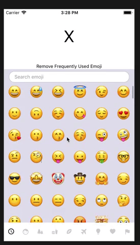

0. L'application doit permettre d'afficher une liste d'emoji et une zone de recherche permettant de filtrer les emoji. 

😀 😃 😄 😁 😆 😅 🤣 😂 🙂 🙃 😉 😊 😇 🥰 😍 🤩 😘 😗 😚 😙 😋 😛 😜 🤪 😝 🤑 🤗 🤭 🤫 🤔 🤐 🤨 😐 😑 😶 😏 😒 🙄 😬 🤥 😌 😔 😪 🤤 😴 😷 🤒 🤕 🤢 🤮 🤧 🥵 🥶 🥴 😵 🤯 🤠 🥳 😎 🤓 🧐 😕 😟 🙁 😮 😯 😲 😳 🥺 😦 😧 😨 😰 😥 😢 😭 😱 😖 😣 😞 😓 😩 😫 😤 😡 😠 🤬 😈 👿

