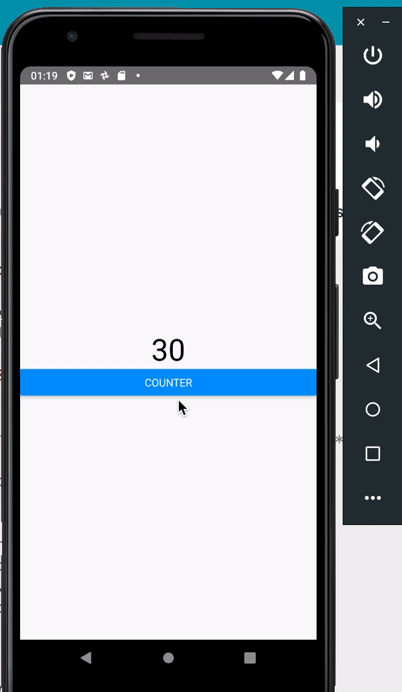

Cet exemple consiste à créer un compteur en utilisant une architecture Redux.

Nous allons commencer par créer une application React native à l'aide de React native CLI.

```console
> react-native init ReduxExample001
```

- Ouvrez ensuite VSCODE en pointant sur le dossier ReduxExample001
- Ajoutez les dépendances Redux comme suit :

```json
"react-redux": "^7.2.0",
"redux": "^4.0.5"
```

- Executez la commande npm install dans la raçine du projet pour installer les dépendances :

```console
> npm install
```

- Créez un dossier src/ dans la racine du projet

- Créez un dossier screens/ dans le dossier src

- Créez un nouveau fichier javascript sur : ./src/screens/counter.js

```javascript
import React from "react";

class Counter extends React.Component {
     /** State local  **/
    state = {
        value: 0,
    };

    /** Fonction appelée lors du clique sur le bouton  **/
    increment = () => {
        this.props.increment(10);
    };

    /** Fonction d'initialisation du DOM  **/
    componentDidMount() {
        console.log("init");
        this.props.init(this.props.initialvalue);
    }

    render() {
        return (
        <View>
            <Text> {this.props.value} </Text>
            <Button title="Counter" onPress={this.increment} />
        </View>
        );
    }

    /** Pour pouvoir dispatcher les actions sans avoir à appeler le dispatch d'une façon directe. Mais passer par d'autres fonctions. **/
    function mapDispatchToProps(dispatch) {
        return {
            init: (initialvalue) => dispatch({type: 'INIT', value: initialvalue}),
            increment: value => dispatch({type: 'INCREMENT', value: 100}),
        };
    }

    /** Cette méthode sera appelée une fois le state global change au niveau du store. La vue connectée va être informée du changement.  **/
    function mapStateToProps(state) {
        return {
            value: state.value,
        };
    }

    /** Cette méthode connect permet la connexion du composant avec le store Redux.  **/
    export default connect(mapStateToProps, mapDispatchToProps)(Counter);
}
```

- Ouvrez le fichier : ./App.js puis ecrasez le avec le code suivant pour pouvoir intégrer le nouveau composant **Counter** :

```javascript
import React from "react";

import { createStore } from "redux";
import { Provider } from "react-redux";
import Counter from "./src/screens/Counter";

/** State initial **/
const initialState = {
  value: 0,
};
/** Création du reducer **/
const reducer = (state = initialState, action) => {
  switch (action.type) {
    case "INCREMENT":
      console.log(state.value + action.value);
      return { value: state.value + action.value };
    case "INIT":
      return { value: action.value };
  }
  return state;
};
/** Création du store **/
const store = createStore(reducer);

class App extends React.Component {
  render() {
    return (
      <Provider store={store}>
        <Counter initialvalue={0} />
      </Provider>
    );
  }
}
```

🔥🔥🔥 [Github repository](https://github.com/AmineZAMANI/ReduxCounterRN) 🔥🔥🔥 

## Et voilà 😊

