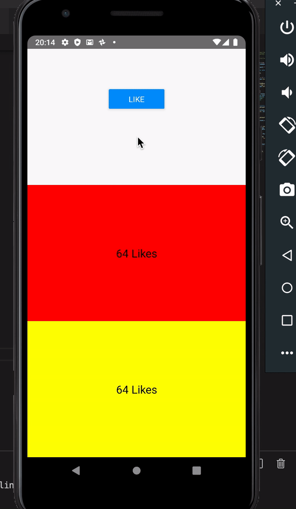

<p style='text-align: justify;'>
Cet exemple consiste à dupliquer le composant [Counter](exemple1.md) 2 fois pour pouvoir créer des composants watchers permettant d'écouter l'activité du store. Au moment du clique sur le bouton du counter les nouveau composants doivent être notifés du changement.</p>

En se basant sur le code existant du projet même Counter : 

**1) Créez le CounterWatcherOne:**
```javascript
import React from 'react';
import {StyleSheet, Button, View, Text} from 'react-native';

import {connect} from 'react-redux';

class CounterWatcherOne extends React.Component {
  state = {
    value: 0,
  };

  componentDidMount() {
    console.log('init');
    this.props.init(this.props.initialvalue);
  }

  render() {
    return (
      <View style={styles.container}>
        <Text style={styles.counterWatcherOne}> {this.props.value} Likes </Text>
      </View>
    );
  }
}

function mapDispatchToProps(dispatch) {
  return {
    init: initialvalue => dispatch({type: 'INIT', value: initialvalue}),
  };
}

function mapStateToProps(state) {
  return {
    value: state.value,
  };
}

export default connect(
  mapStateToProps,
  mapDispatchToProps,
)(CounterWatcherOne);

/**
    Styles 
**/
const styles = StyleSheet.create({
  counterWatcherOne: {
    fontSize: 20,
    textAlign: 'center',
  },
  container: {
    backgroundColor: 'red',
    flex: 1,
    justifyContent: 'center',
  },
});

```

**2) Ensuite créez le CounterWatcherTwo:**
```javascript
import React from 'react';
import {StyleSheet, Button, View, Text} from 'react-native';

import {connect} from 'react-redux';

class CounterWatcherOne extends React.Component {
  state = {
    value: 0,
  };

  componentDidMount() {
    console.log('init');
    this.props.init(this.props.initialvalue);
  }

  render() {
    return (
      <View style={styles.container}>
        <Text style={styles.counterWatcherOne}> {this.props.value} Likes </Text>
      </View>
    );
  }
}

function mapDispatchToProps(dispatch) {
  return {
    init: initialvalue => dispatch({type: 'INIT', value: initialvalue}),
  };
}

function mapStateToProps(state) {
  return {
    value: state.value,
  };
}

export default connect(
  mapStateToProps,
  mapDispatchToProps,
)(CounterWatcherOne);

/**
    Styles 
**/
const styles = StyleSheet.create({
  counterWatcherOne: {
    fontSize: 20,
    textAlign: 'center',
  },
  container: {
    backgroundColor: 'yellow',
    flex: 1,
    justifyContent: 'center',
  },
});
```

Il nous reste maintenant que de déclarer nos composants dans le fichiers App.js :

> Notez bien que les deux composants sont connectés au store via la fonction connect(...)

```javascript

import CounterWatcherOne from './src/screens/CounterWatcherOne';
import CounterWatcherTwo from './src/screens/CounterWatcherTwo';

...

<Provider store={store}>
    <Counter initialvalue={1} />
    <CounterWatcherOne initialvalue={0} />
    <CounterWatcherTwo initialvalue={0} />
</Provider>

...
```

🔥🔥🔥 [Github repository](https://github.com/AmineZAMANI/SimpleCounterRN) 🔥🔥🔥 

## Et voilà 😊

