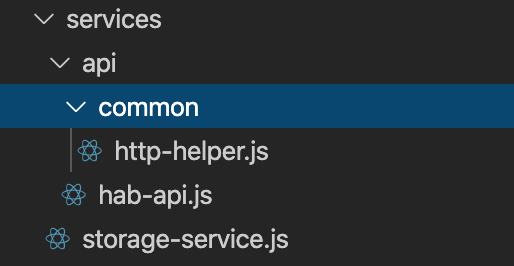

### 1. Aperçu théorique :


La plupart des applications mobile chargent les données en consommant des webservices REST. Pour répondre à ce besoin, React Native fournit une API native nommée Fecth qui couvre ce besoin. Mais pour plus de facilité d'utilisation et de compatibilité on va opter pour une librairie Tiers nommée [axios](https://github.com/axios/axios).

### 2. Aperçu pratique :

Afin de pouvoir résoudre le probleme relatif à la connexion aux serveurs avec une certification auto-signée on a choisi d'utiliser temporairement la librairie [rn-fetch-blob](https://github.com/joltup/rn-fetch-blob) qui permet d'autorsier ce genre de connexion grace au paramétre : trusty 

```javascript
RNFetchBlob.config({trusty: true}).fetch(
      'POST'...
```

Les services permettant la communication avec le serveurs sont situés dans le dossier : ./src/services/api/ :



Tous ces services utilisent les fonctions helpers de la class HttpHelper afin de garantir une reutilisation dans les prochains services api. La class HttpHelper contient deux fonctions :

- login : fonction utilisée pour authentifier l'utilisateur

```javascript
static async login(user) {...}
```

- process : fonction générique qui permet d'appeler les services exposés en fonction des parametres envoyés :

```javascript
static async process(user) {...}
```

Exemple d'utilisation de la fonction process :

```javascript
static confirmConnexion = async (codeBureau, listeProfilCoche, login) => {
    const data = {
      dtoHeader: {
        userLogin: login,
        fonctionnalite: 'cf4011',
        module: 'HAB_LIB',
        commande: 'confirmerConnexionAgent',
        typeService: 'SP',
      },
      jsonVO: {
        codeBureau: codeBureau,
        listProfilsCoche: listeProfilCoche,
      },
    };
    return await HttpHelper.process(data);
  };
```

<p style='text-align: justify;'>
Les services api sont généralement appelées au niveau de la creation de l'action pour pouvoir dispatcher l'action adéquate selon le résultat obtenu dans la réponse du webservice REST.</p>

On prend l'exemple du service api d'authentification : 
```javascript
    /** Login in progress */
    ...
    HabApi.login(action.value.login, action.value.pwd)
      .then(data => {
        if (data) {
          if (data.statutConnexion === '1') {
            dispatch(success(data));
            ...
          } else {
            dispatch(failed(data));
            ...
          }
        } 
      })
      ...
  };
```

