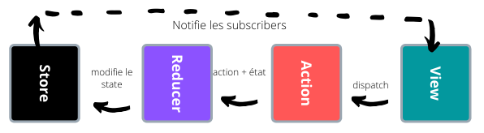

### 1. Aperçu théorique :

<p style='text-align: justify;'>Redux est une architecture unidirectionnelle qui assure l'acheminement des données de bout en bout comme vous pouvez le remarquer dans le schéma ci-dessous : </p>



<p style='text-align: justify;'>Le process est déclanché suite à une demande de l'utilisateur (partie View) qui expédit un flux (une action d'un type donné (exmple ACTION_LOGIN) accompagné d'un payload) qui contient la valeur du nouveau state. L'action est systématiquement transmise au Reducer qui est une fonction qui permet de modifier le state de l'application selon l'action reçue. Une fois le store modifié, toutes les vues abonnées à ce store seront automatiquement informées du changement.</p>

### 2. Aperçu pratique :

#### 2.1 Installation

Les dépendances Redux sont déclarées au niveau du fichier package.json comme suit :

```json
"redux": "^4.0.5",
"react-redux": "^7.1.3",
"redux-thunk": "^2.3.0",
```

- **redux** : La librairie principale (Core)
- **redux-thunk** : un middleware redux qui vous aide avec des actions asynchrones prédéfinies (appel du dispatch dans la vue, routing, logging, crash reporting).
- **react-redux** : Connecte le store Redux avec les composants React

#### 2.2 Import & Utilisation

Aprés avoir installer les librairies nécéssaires, il est temps maintenant de les importer dans le projet. Au niveau du fichier App.js on ajoute les imports suivants :

```javascript
/** REDUX */
import { Provider } from "react-redux";
import { createStore, applyMiddleware } from "redux";
import allReducers from "./redux/reducers";
import thunk from "redux-thunk";

const middleware = [thunk];
const store = createStore(allReducers, applyMiddleware(thunk));
```

<p style='text-align: justify;'>La fonction createStore permet de créer un store en précisant le reducer (dans notre cas allReducers est l'ensemble des reducers implementés dans notre application) et un enhancer "applyMiddleware(thunk) qui va nous faciliter l'utilisation de la fontion dispatch".

Aprés avoir créer notre store, il maintenant essentiel de le rendre disponible pour l'ensemble des composants (Subscribers). On le fait avec la balise Provider :

```JSX
<Provider store={store}>
    /** Your components here **/
    ...
<Provider>
```

</p>

Au niveau du dossier Redux, on remarque la présence de deux sous dossier : Actions et Reducers


Une Action est un objet avec deux paramètres :

- Un type : Le type qui correspond à l'action, Exemple : AUTH_LOGIN_IN_PROGRESS
- Une valeur : les données envoyées

```javascript
export function request(action, navigation) {
  return dispatch => {
    ...
    dispatch(inProgress(action));
    ...
  }
}

export function inProgress(action) {
  return {
    type: Constants.AUTH_LOGIN_IN_PROGRESS,
    value: action.value,
  };
}
```

<p style='text-align: justify;'>Aprés avoir appeler un dispatch, le reducer va automatiquement mettre à jour le state global puis notifier la vue afin d'appliquer le changement sur le composant abonné.

Exemple : dans le cas du dispatch de l'action AUTH_LOGIN_IN_PROGRESS le reducer va mettre la valeur showProgress à true, ce qui va être répercuté sur le store :</p>

```javascript
export default (state = initialState, action) => {
  let nextState = {
    ...state,
    value: action.value,
  };
  switch (action.type) {
    case Constants.AUTH_LOGIN_REQUEST:
      ...
      return nextState;
    case Constants.AUTH_LOGIN_IN_PROGRESS:
      nextState.showProgress = true
      console.log('--> login in progress...');
      return nextState;
```

Et enfin mettre à jour la vue pour afficher le composant de la progression :

```JSX
 {this.props.showProgress && <BadrProgressBar />}
```

<p style='text-align: justify;'>Les reducers sont combinés dans le fichier ./src/redux/reducers/index.js afin d'être utilisés par la méthode createStore dans le fichier App.js.</p>

```javascript
/**
 * combine all reducer
 */
const allReducers = combineReducers({
  authReducer,
  smsVerifyReducer,
  confirmConnexionReducer,
  menuReducer,
});
```

Tous les types d'actions sont déclarés au niveau du dossier : ./src/common/constants/ :

Exemple du cas de l'authentification :

```javascript
export const AUTH_LOGIN_REQUEST = "[AUTH] AUTH_LOGIN_REQUEST";
export const AUTH_LOGIN_SUCCESS = "[AUTH] AUTH_LOGIN_SUCCESS";
export const AUTH_LOGIN_FAILED = "[AUTH] AUTH_LOGIN_FAILED";
export const AUTH_LOGIN_IN_PROGRESS = "[AUTH] AUTH_LOGIN_IN_PROGRESS";
export const AUTH_LOGOUT = "[AUTH] LOGOUT";
export const LOGIN_INIT = "[AUTH] LOGIN_INIT";
```

### Presque fini !

<p style='text-align: justify;'>Tout ce qu'il nous reste est connecter store Redux à notre composant grace à la fonction connect. En suivant la documentation officielle de react-redux sur Github, il faut créer la fonction mapStateToProps : </p>

```javascript
const mapStateToProps = state => ({...state.authReducer});
```
<p style='text-align: justify;'>
- mapStateToProps :  Si cet argument est spécifié, le composant s'abonnera aux mises à jour du store Redux. Cela signifie qu'à chaque fois que le store est mis à jour, mapStateToProps sera appelé. </p>

```javascript
export default connect(
  mapStateToProps,
  null,
)(Login);
```
