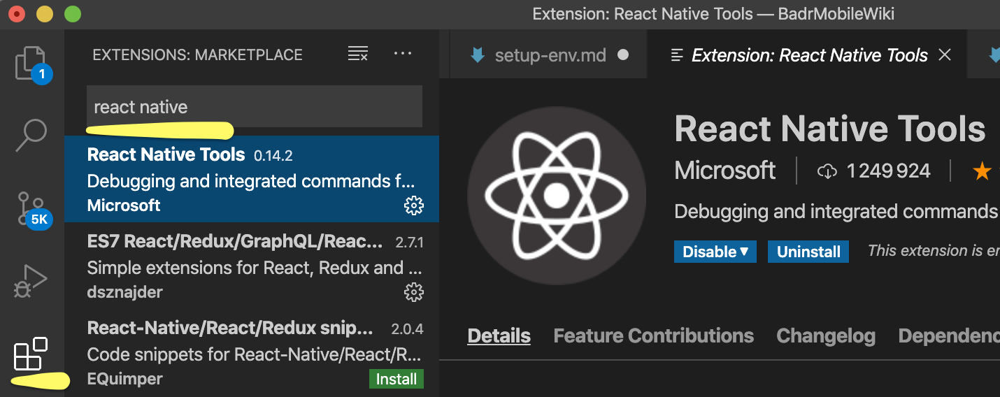
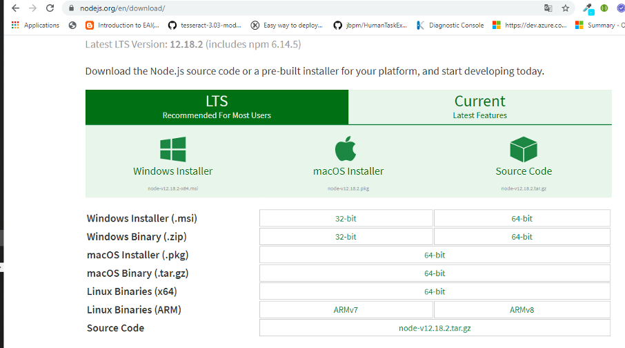
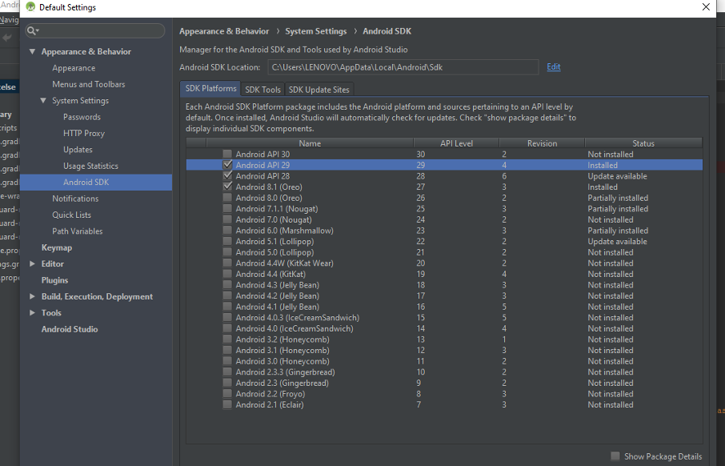
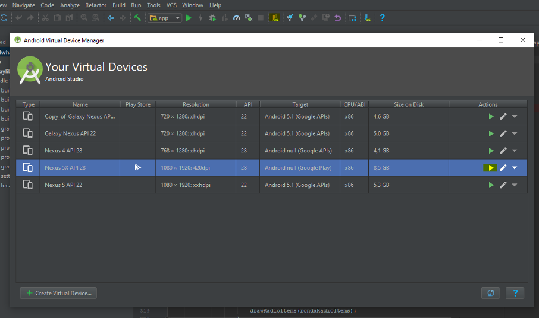
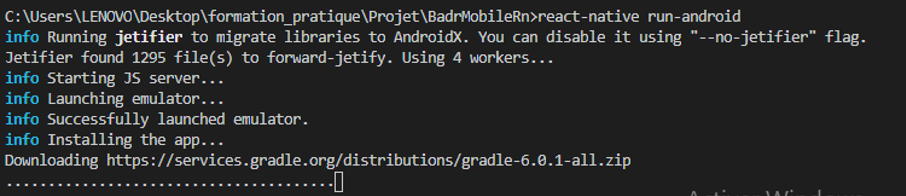
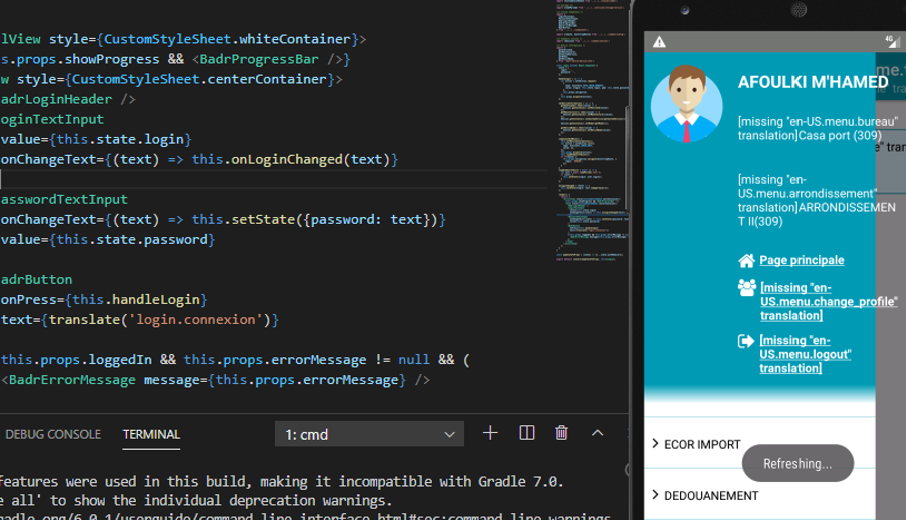

0. Récuperer les sources depuis github via la commande : 

```git
> git clone https://github.com/AmineZAMANI/BadrMobileRn.git
```

1. Installez l'outil [VisualCode](https://code.visualstudio.com/) puis ouvrez le dossier du projet.

2. Installez le plugin React native Tools



3. Allez sur https://nodejs.org/en/download/ puis installez la dernière version de NodeJs.



```console
> node -v
```

4. Allez sur https://developer.android.com/studio puis installez la dernière version d'Android studio avant de vérifier qu'au moins un sdk platform est bien installé (Exemple : API 29) :
   

5. Installez React Native CLI

```console
> npm install –g react-native-cli
```

6. Ouvrez le projet que vous avez récupéré depuis git dans Visual Code puis dans un nouveau terminal lancez la commande :

```console
> npm install
```

7. Ouvrez Android studio, créez un nouveau virtual device puis lancez le en cliquant sur "Start" :

   

8. Démarrez l'application via la commande :

```console
> react-native run-android
```



9. Dés que l'application est lancée vérifiez que le hot reloading marche bien en s'assurant que l'écran s'actualise lors d'un CTRL+S éxécuté sur une vue : 



