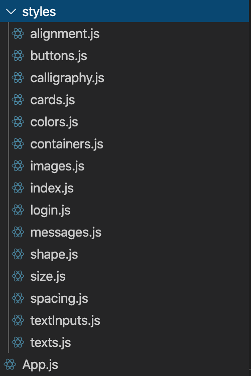

### Les styles de l'application sont situés au niveau du dossier : **./src/styles/index**

La répartition des styles a été faite par type de composant : 

```javascript
import * as Buttons from './buttons';
import * as Inputs from './textInputs';
import * as Texts from './texts';
import * as Images from './images';
import * as Messages from './messages';
import * as Login from './login';
import * as Containers from './containers';
import * as Cards from './cards'

import {StyleSheet} from 'react-native';

const CustomStyleSheet = StyleSheet.create({
  whiteContainer: {
    ...Containers.whiteContainer,
  },
  ...
```
Puis on utilise le style tout simplement par : 
```javascript
/** STYLING **/
import {CustomStyleSheet} from '../../styles/index';
...
  <ScrollView style={CustomStyleSheet.whiteContainer}>
...
```


### Bonnes pratiques pour bien gérer les styles de l'application :

- **Les styles sont importants: rendez-les faciles à trouver:**

<p style='text-align: justify;'>
les styles doivent être accessibles à partir d'un dossier de niveau supérieur dans le code de l'application. Une autre façon de penser est que nous voulons minimiser l’utilisation des "../" dans nos chemins relatifs. Cela réduit non seulement la quantité de surcharge mentale dans le comptage des dossiers imbriqués, mais permet une refactorisation et une compréhension plus faciles à mesure que le projet évolue.
</p>

```javascript
import { CustomStyleSheet } from "../../styles/index";
```

Est plus simple d'utilisation et de maintenance que :

```javascript
import { CustomStyleSheet } from "../../../../common/utils/styles/index";
```

- **Les styles doivent être réutilisable le maximum possible :**

En utilisant la déstructuration d'objets dans la déclaration de style, nous obtenons des styles vraiment concis et lisibles qui nous permettent d'être déclaratifs dans nos composants.

```javascript
export const loginButton = {
  ...primaryBackgroundColor,
  ...loginButtonAlignment,
  ...loginButtonSpacing,
  ...loginButtonShape,
  ...loginButtonSize,
};

export const badrButton = {
  ...primaryBackgroundColor,
  ...loginButtonAlignment,
  ...loginButtonShape,
  ...loginButtonSize,
};
```

Est plus simple d'utilisation et de maintenance que :

```javascript
const loginButtonStyle = StyleSheet.create({
  button: {
    backgroundColor: 10,
    alignItems: "center",
    justifyContent: "center",
    borderRadius: 10,
    padding : 50,
    margin : 20,
    width: 280,
    height: 50,
  },
});

const badrButtonStyle = StyleSheet.create({
  button: {
    backgroundColor: 10,
    alignItems: "center",
    justifyContent: "center",
    borderRadius: 10,
    width: 280,
    height: 50,
  },
});
```

- **Rendez les styles facile à utiliser :**

Regroupez des variables similaires dans des modules et regroupez-les dans un fichier index.js.

```javascript
import * as Buttons from './buttons';
import * as Inputs from './textInputs';
import * as Texts from './texts';
import * as Images from './images';
import * as Messages from './messages';
import * as Login from './login';
import * as Containers from './containers';
import * as Cards from './cards'

import {StyleSheet} from 'react-native';

const CustomStyleSheet = StyleSheet.create({
  badrCardText : {
    ...Texts.cardText
  },
  badrCard: {
    ...Cards.badrCard
  },
  badrButton: {
    ...Buttons.badrButton
  },

  ...
  ...

export {CustomStyleSheet};
```

Les variables de style sont plus faciles à trouver et à comprendre lorsqu'elles sont organisées par fonction. Par conséquent, ils doivent vivre dans des fichiers utiles.



Si nous plaçons un index.js dans ce dossier, nous pouvons profiter de la syntaxe d'importation JavaScript ES6 pour importer tous les styles à la fois.

Cela va nous permettre de :

- Importer uniquement ce dont nous avons besoin
- Importer à partir du même fichier à chaque fois
- Donner aux variables des noms descriptifs et abrégés, contenus dans un objet descriptif.
- Etendre et modifier facilement les styles courants
- Ecrire du code plus concis et expressif.
